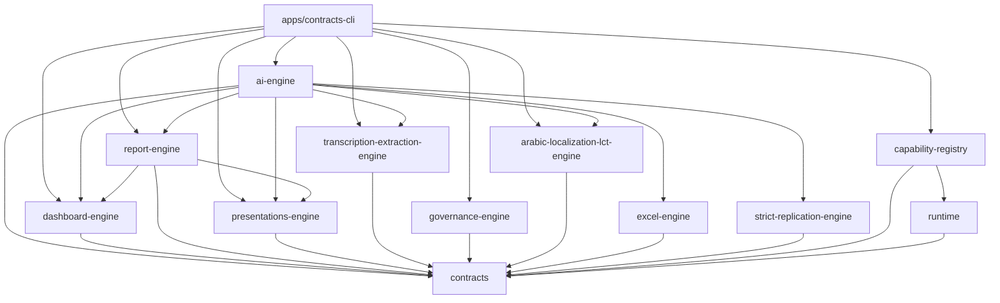

# Architecture Overview

## 1. System Shape

The repository contains two real runtime styles:

1. The active engine-first platform in [rasid-platform-core](/C:/ALRaMaDy/rasid-platform-core).
2. The separate full-stack app in [apps/rasid-web](/C:/ALRaMaDy/rasid-platform-core/apps/rasid-web), which still uses its own API and persistence model.

The engine-first path is the architectural center of gravity. It uses:

- `packages/contracts` for shared schemas and action/tool contracts
- `packages/*-engine` for domain workflows
- `packages/capability-registry` and `packages/runtime` for capability bootstrap, approval hooks, and evidence hooks
- `apps/contracts-cli` as the bootstrap and server host
- `.runtime/*` filesystem trees as the primary operational persistence layer

## 2. Active Runtime Lanes

| Lane | Entry point | Role | Persistence |
| --- | --- | --- | --- |
| Unified gateway | [apps/contracts-cli/src/dashboard-web.ts](/C:/ALRaMaDy/rasid-platform-core/apps/contracts-cli/src/dashboard-web.ts) | Main multi-surface platform server for data, dashboards, reports, presentations, localization, governance, and AI orchestration | `.runtime/*` |
| Transcription server | [apps/contracts-cli/src/transcription-web.ts](/C:/ALRaMaDy/rasid-platform-core/apps/contracts-cli/src/transcription-web.ts) | Narrower transcription-focused UI/API | `.runtime/transcription-*` |
| Report platform | [packages/report-engine/src/platform.ts](/C:/ALRaMaDy/rasid-platform-core/packages/report-engine/src/platform.ts) | Standalone report UI/API | `.runtime/report-engine*` |
| Presentations platform | [packages/presentations-engine/src/platform.ts](/C:/ALRaMaDy/rasid-platform-core/packages/presentations-engine/src/platform.ts) | Standalone presentation UI/API | `.runtime/presentations-engine` |
| `rasid-web` | [apps/rasid-web](/C:/ALRaMaDy/rasid-platform-core/apps/rasid-web) | Separate React + Express + tRPC app shell | `data/rasid.db`, optional MySQL, `uploads/` |

## 3. Dependency Graph

## 4. Internal Service Communication

### Unified gateway path

1. Browser loads a page such as `/dashboards` or `/governance`.
2. Embedded client script calls `/api/v1/...`.
3. The gateway builds an auth and governance context.
4. `GovernanceEngine` evaluates allow, deny, or approval-required.
5. The selected engine executes the domain action.
6. The engine store writes state, artifacts, evidence, audit, and lineage.
7. The gateway returns JSON plus a continuation path such as `open_path`.

This is the standard pattern for:

- dashboard create/mutate/refresh/publish/share/schedule
- transcription start and compare
- AI jobs
- report-to-dashboard and report-to-presentation conversions
- dashboard localization and strict replication consumption

### Standalone platform path

The report and presentation platform servers own their own HTML shells and route handlers, but internally they still call the same `ReportEngine` and `PresentationEngine` classes used elsewhere in the monorepo.

### `rasid-web` path

1. React page/component calls `trpc.<namespace>.<procedure>`.
2. Express exposes `/api/trpc`.
3. `routers.ts`, `aiRouter.ts`, or `libraryRouter.ts` handles the request.
4. The handler reads/writes either:
   - `localDb.ts` (`sql.js`)
   - `db.ts` + Drizzle/MySQL
   - external AI/storage/provider helpers

This means `rasid-web` is not yet a thin adapter over the shared engines.

## 5. Architectural Seams

### Stable seams

- Contract schemas in [packages/contracts](/C:/ALRaMaDy/rasid-platform-core/packages/contracts)
- Capability bootstrap in [packages/capability-registry](/C:/ALRaMaDy/rasid-platform-core/packages/capability-registry)
- Engine store boundaries in each `packages/*-engine/src/store.ts`
- Standalone platform wrappers in `report-engine` and `presentations-engine`

### Tension points

- `dashboard-web.ts` is a large route monolith that owns auth, rendering, governance wrapping, and many domain actions.
- `apps/rasid-web` duplicates product concerns with a different persistence and auth model.
- The active runtime is file-backed, so concurrency, multi-instance coordination, and transactional guarantees are weak compared with a shared database or queue broker.

## 6. Dependency Management Model

The monorepo uses npm workspaces declared in [package.json](/C:/ALRaMaDy/rasid-platform-core/package.json) and TypeScript project references declared in [tsconfig.json](/C:/ALRaMaDy/rasid-platform-core/tsconfig.json).

Key rules:

- shared contracts sit at the bottom of the dependency graph
- engine packages depend on contracts, plus a small number of sibling engines where conversion is required
- bootstrap apps depend on engines and registry/runtime packages
- the `rasid-web` app does not consume the shared engine packages directly; it is a separate application line

## 7. Scaling Strategy

The current architecture scales up more easily than it scales out.

### What scales acceptably today

- running the unified gateway as a single Node process
- splitting report, presentation, and transcription servers into separate processes
- persisting engine outputs to separate runtime folders by entity id

### What blocks horizontal scale

- filesystem-backed operational state
- synchronous file I/O in stores
- no shared queue broker for heavy jobs
- no distributed lock or lease system for scheduled work
- auth and policy state being process-local in several servers

## 8. Future Extension Points

The safest high-value extension seams are:

1. Replace `.runtime/*` with a shared object store + metadata database without changing contract shapes.
2. Extract route families from `dashboard-web.ts` into composable server modules behind one gateway.
3. Turn `apps/rasid-web` routers into adapters that call shared engines instead of `localDb.ts`.
4. Add a real queue/worker layer for report export, parity validation, localization, strict replication, and AI orchestration.
5. Centralize auth and tenant policy middleware across all servers.

## 9. Related Documents

- [system-overview.md](/C:/ALRaMaDy/docs/system-overview.md)
- [c4-context.md](/C:/ALRaMaDy/docs/c4-context.md)
- [c4-containers.md](/C:/ALRaMaDy/docs/c4-containers.md)
- [c4-components.md](/C:/ALRaMaDy/docs/c4-components.md)
- [modules.md](/C:/ALRaMaDy/docs/modules.md)
